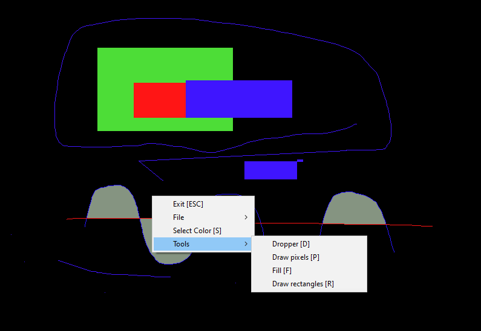

# T33GEDIT: Simple graphic editor
Last code update: 25.12.2021

This project allows user to draw lines (using Bresenham's algorithm) or rectangles, select drawing color (using dropper or color picker box) load and save images (in binary format G24).

